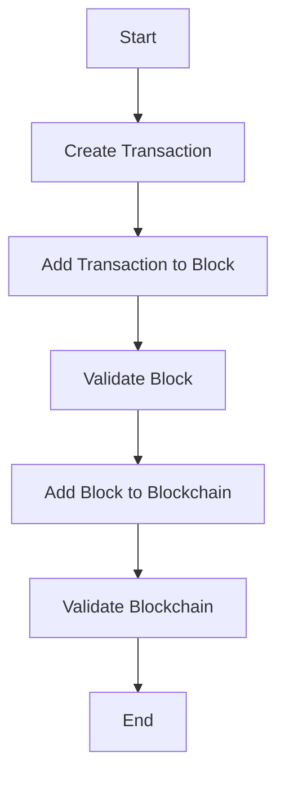

# Simple-Blockchain

A layman implementation of a blockchain to understand concepts at a deeper level.

## Table of Contents

- [Introduction](#introduction)
- [Features](#features)
- [Installation](#installation)
- [Usage](#usage)
- [Flowchart](#flowchart)
- [Contributing](#contributing)
- [License](#license)

## Introduction

This project is a simple implementation of a blockchain in JavaScript. It is designed to help understand the core concepts of blockchain technology.

## Features

- Create blocks
- Validate blockchain
- Add transactions

## Installation

To install the project, clone the repository and install the dependencies:

```bash
git clone https://github.com/kedarvartak/Simple-Blockchain.git
cd Simple-Blockchain
npm install
```

## Usage

After installation, you can run the project using:

```bash
npm start
```

## Flowchart

The following flowchart explains the flow of the app:



## Contributing

Contributions are welcome! Please open an issue or submit a pull request for any improvements or additions.

## License

This project is licensed under the MIT License.

